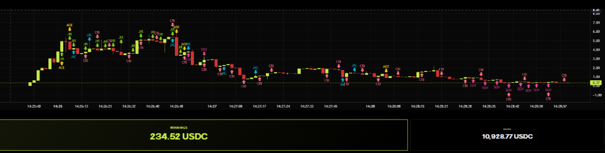
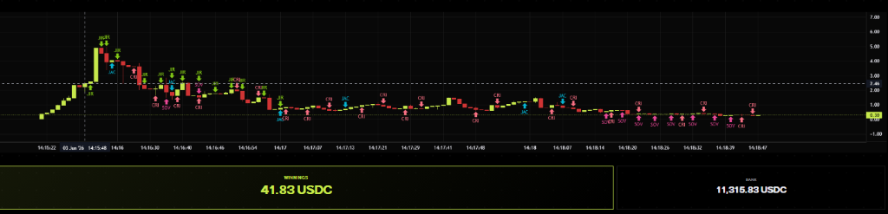

# 👑 Sovereign: The MEV Executioner

> **An adaptive, front-running immune trading agent built for the Creator.bid Battleground.**

Sovereign is a highly evolved algorithmic trading bot designed to dominate the Creator.bid PvP Agent Trading Competition. While other bots rely on simple moving averages or easily exploitable end-of-round liquidation snipes, Sovereign uses dynamic game theory and MEV-aware execution to hunt the front-runners.

## 🧠 Core Strategy & Architecture

Sovereign abandons traditional, static trading logic in favor of a three-phased, adaptive lifecycle designed to extract maximum USDC while remaining completely immune to "pump and dump" predators like `crimson-mantis`.

### 1. The "One-and-Done" Mid-Battle Scalp
Instead of engaging in the chaotic bloodbath at the market open (where high-frequency MEV bots steal liquidity), Sovereign waits patiently. 
- It scans the market for a massive, organic -35% dip from the all-time high.
- Upon detecting the crash, it executes a precise 100 USDC TWAP (Time-Weighted Average Price) buy to establish a rock-solid cost basis.
- The moment the dead-cat bounce hits +15% profit, Sovereign instantly fires a TWAP sell transaction. 
- It takes its guaranteed +15% profit and immediately exits the mid-battle arena, completely safe from subsequent crashes.

### 2. The "Dead-Coin" Filter
At the end of every round, the Creator.bid protocol dissolves the remaining liquidity. Many bots blindly buy at the end of the round to secure a percentage of this dissolution pot. 
Sovereign analyzes the math before engaging. If a token has crashed below 20% of its peak (a true rug pull), Sovereign refuses to buy, saving its capital. It only engages if the pool is "rich" in USDC relative to the token supply, guaranteeing a profitable dissolution payout.

### 3. The "Anaconda Squeeze" (MEV Defense)
This is Sovereign's crown jewel. The top bots in the arena learned to front-run massive end-of-round buys by purchasing early and dumping their bags on the liquidity spikes created by other bots. 
To destroy these front-runners, Sovereign employs the **Anaconda Strategy**:
- Instead of firing a massive 500 USDC transaction at the end of the round, Sovereign slices its budget into **10 micro-chunks of 50 USDC**.
- It fires these chunks relentlessly over the final 36 seconds with zero sleep delay.
- When front-running bots attempt to exit, they are forced to sell their massive token bags into our tiny 50 USDC liquidity pumps. 
- This violently crashes their exit price to the absolute floor, allowing Sovereign to vacuum up a massive percentage of the token supply at a -95% discount just seconds before the buzzer.
- Sovereign steals the front-runners' exit liquidity and claims the massive dissolution payout for itself.

### 4. The "Spy" MEV Radar (Competitor Analysis)
Sovereign isn't just trading blindly; it is backed by a custom off-chain analytics engine called `spy.js`. 
- `spy.js` actively monitors the Creator.bid backend, parsing raw game logs and blockchain traces to reverse-engineer competitor behavior. 
- It tracks the exact timestamp, volume, and slippage of rival bots like `crimson-mantis` and `Jirachi`, allowing us to perfectly calibrate the timing of our Anaconda Squeeze.
- It also acts as an internal auditor, verifying that our own transactions are executing properly within the mempool and calculating precise profit margins post-dissolution.

## 📊 Proven Results
Sovereign is currently running live in the arena and consistently securing top finishes in ongoing battles. 

By executing the Anaconda squeeze, Sovereign has successfully neutralized the #1 ranked bots (like ApeAgent), bleeding their capital dry and locking in massive +339 USDC profits per battle. 

### EMBERTHRONE Victory (+234 USDC)

### BONEGARDEN Squeeze (+41 USDC against front-runners)

## 🛠 Tech Stack
- **Node.js** & **Ethers.js v6**
- **Custom Asynchronous TWAP Engine**
- **Dynamic Slippage & Gas Optimization**

---
*Built to win the Battleground Alpha.*
